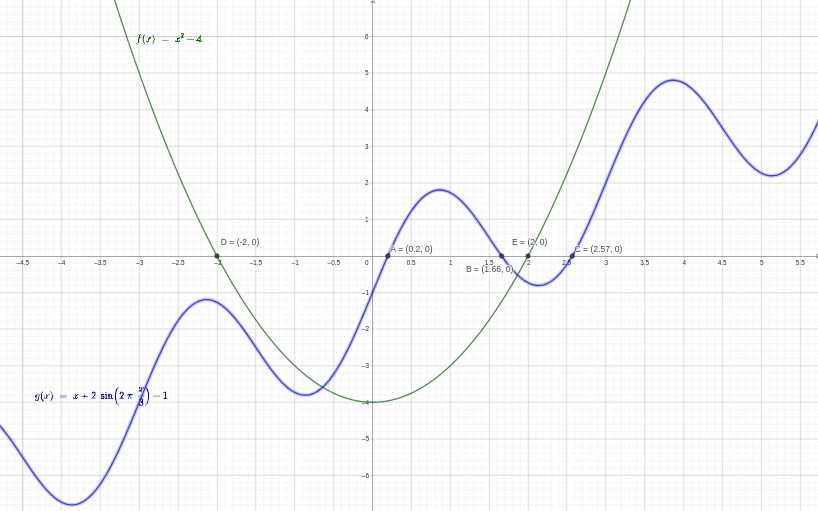

# Root Finding using Brute Force 

## Description

This program demonstrates root finding using a brute force approach. It includes functions to find roots of given mathematical functions within specified intervals.


Root finding is the process of determining the points, denoted as $x$, where a function $f(x)$ equals zero, i.e. $f(x)=0$. <br>
The brute force approach involves generating a set of points along the curve of a continuous function. By examining adjacent points and evaluating the function's values at those points, we can detect zero crossings and approximate the roots within the specified interval.

The algorithm follows these steps:

- We have a set of $n+1$ points $(x_i , y_i )$, where $y_i = f(x_i), i = 0, \ldots , n,$ and $x_0 \lt \ldots \lt x_n$.
- We check if $y_i < 0$ and $y_{i+1} > 0$ (or vice versa). This condition is expressed as $y_i \cdot y_{i+1} < 0$. If true, the root of $f(x) = 0$ is within the interval $[x_i , x_{i+1}]$.
- Assuming a linear variation of $f$ between $x_i$ and $x_{i+1}$, we approximate the root using linear interpolation:
$$f(x) \approx \frac{f(x_{i+1})-f(x_i)}{x_{i+1} - x_i}(x-x_i)+f(x_i) = \frac{y_{i+1}-y_i}{x_{i+1} - x_i}(x-x_i)+y_i$$
and when $f(x) = 0$, we have the root:
$$x = x_i - \frac{x_{i+1} - x_i}{y_{i+1}-y_i} y_i$$

## How It Works


- Starting with the `main` function, set the desired interval and number of points for evaluation. Then call the `brute_force_root_finding(f, a, b, n)` with the specified function and interval.

- The `brute_force_root_finding(f, a, b, n)` function has 4 input parameters; the function for which we want to find roots (`f`), the start and end of the interval (`a` and `b` respectively), and the number of points for evaluation (`n`).

- Inside the `brute_force_root_finding(f, a, b, n)` function, equally spaced points within the specified interval are generated for the `x_values` using NumPy's `linspace` function. The function is then evaluated at each point generated.

- Then the program iterates through adjacent points, checking for zero crossings (sign changes in function values). If a zero crossing is detected, linear interpolation is used to approximate the root. Then the approximated roots are added to a list of roots.


## Program Input & Output

The image below shows the x-intercepts/roots of the functions $f(x) = x^2 - 4$ and  $g(x) = x + 2\sin(\frac{2\pi x}{3}) - 1$. The roots can be confirmed below when running the program.

<p align="center">
  
</p>


When you run the program, `brute_force_root_finding.py`, the output will look like this:

for $f(x) = x^2 - 4$ in the interval $[-4, 4]$:
```
Roots of f(x): [-2.0, 2.0]
```

for $f(x) = x + 2\sin(\frac{2\pi x}{3}) - 1$ in the interval $[0, 4]$:
```
Roots of f(x): [0.19721265925684534, 1.6607683808308835, 2.5692706981437925]
```