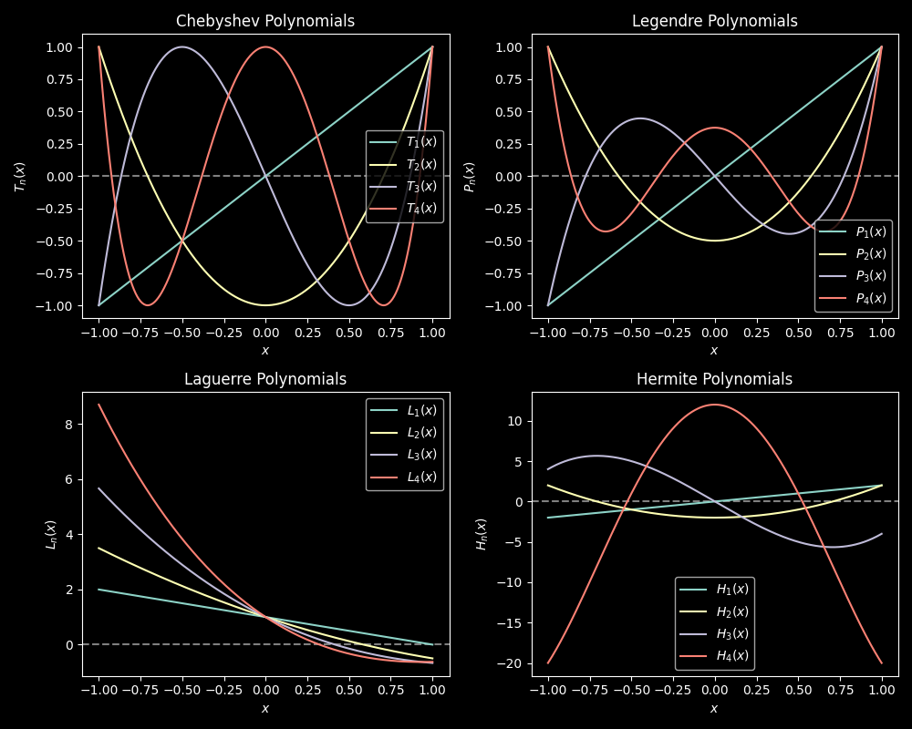

# Orthogonal Polynomials Evaluation

## Description

The program, `orthogonal_evaluation.py`, evaluates orthogonal polynomials, specifically Chebyshev, Legendre, Laguerre, and Hermite polynomials, for a given order and input value. It also calculates the derivatives of these polynomials.

The program, `orthogonal_plot.py`, allows you to visualize the Chebyshev, Legendre, Laguerre, and Hermite polynomials, for various orders. It uses the `scipy.special` library for evaluating these polynomials.

Orthogonal polynomials are a set of polynomials with specific properties, such as orthogonality with respect to a weight function over a specified domain.

- **Chebyshev Polynomials**: These polynomials are orthogonal with respect to the weight function $(1-x^2)^{\frac{1}{2}}$ over the interval $[-1, 1]$. The n-th order Chebyshev polynomial $T_n(x)$ can be recursively calculated using the recurrence relation.

- **Legendre Polynomials**: These polynomials are orthogonal with respect to the weight function $1$ over the interval $[-1, 1]$. The n-th order Legendre polynomial $P_n(x)$ can be recursively calculated using the recurrence relation.

- **Laguerre Polynomials**: These polynomials are orthogonal with respect to the weight function $e^{-x}$ over the interval $[0, \infty)$. The n-th order Laguerre polynomial $L_n(x)$ can be recursively calculated using the recurrence relation.

- **Hermite Polynomials**: These polynomials are orthogonal with respect to the weight function $e^{-x^2}$ over the entire real line $(-\infty, \infty)$. The n-th order Hermite polynomial $H_n(x)$ can be recursively calculated using the recurrence relation.


## How it Works

- The `main` function sets example values for `x`, `n`, `l`, `m`, and `k`. It then evaluates orthogonal polynomials using both the `scipy.special` library and manual calculation methods. The results are printed for comparison.

- There are four orthogonal polynomial evaluation functions (`evaluate_chebyshev`, `evaluate_legendre`, `evaluate_laguerre`, and `evaluate_hermite`) that calculate the polynomial and its derivative. These functions use recursion and follow the recurrence relations specific to each polynomial type.

## Program Input & Output

When you run the program, `orthogonal_plot.py`, the output will look like this;

<p align="center">
  
</p>

The above plot shows Chebyshev, Legendre, Laguerre, and Hermite polynomials for orders 1 to 4. The x-axis represents the input values, and the y-axis represents the polynomial values.

When you run the program, `orthogonal_evaluation.py`, the output will look like this;

```

Evaluating Orthogonal Polynomials

Chebyshev Polynomial of order 3 at x=0.5
Chebyshev(3) using scipy.special: -1.0
Chebyshev(3) evaluated manually: -1.0
Derivative of Chebyshev(3): -0.0

Legendre Polynomial of order 3 at x=0.5
Legendre(3) using scipy.special: -0.43749999999999994
Legendre(3) evaluated manually: -0.4375
Derivative of Legendre(3): 0.375

Laguerre Polynomial of order 3 at x=0.5
Laguerre(3, 1) using scipy.special: -0.14583333333333331
Laguerre(3, 1) evaluated manually: -0.14583333333333334
Derivative of Laguerre(3, 1): -1.6250000000000002

Hermite Polynomial of order 3 at x=0.5
Hermite(3) using scipy.special: -5.000000000000001
Hermite(3) evaluated manually: -5.0
Derivative of Hermite(3): -6.0

```