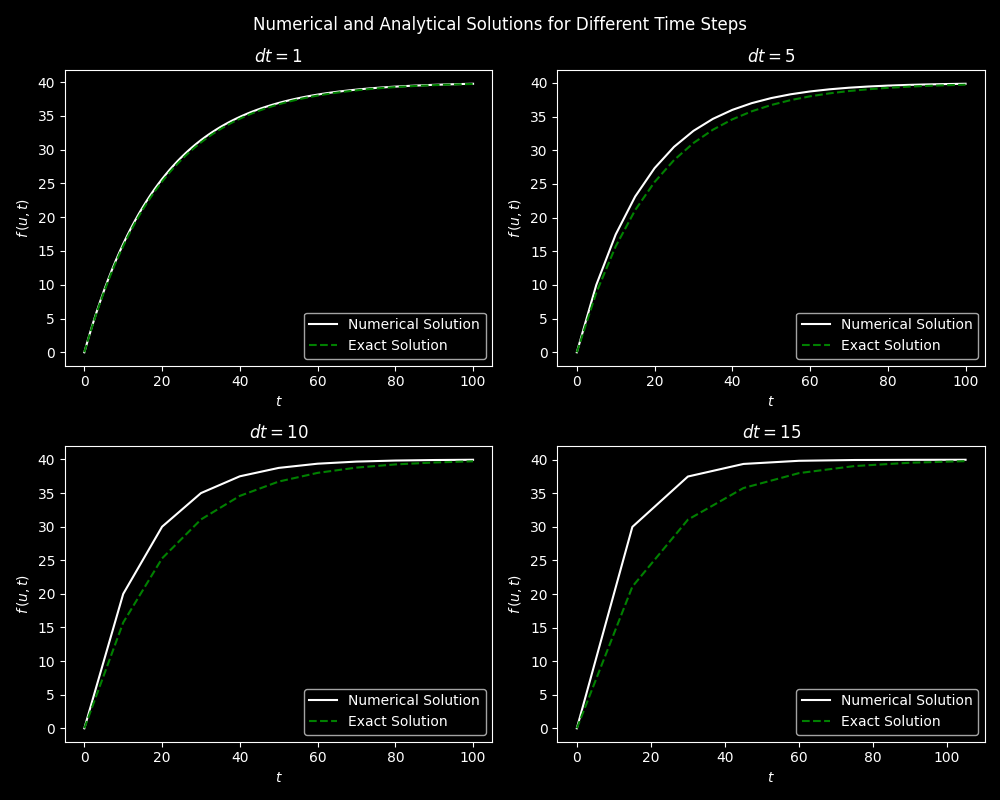

# Solving Ordinary Differential Equation (ODE) with Forward Euler Method

## Description

This Python program demonstrates the numerical solution of ordinary differential equations (ODEs) using the Forward Euler method. It provides a clear visualization of both numerical and analytical solutions for different time step values.

The program is based on the concept of solving first-order ODEs with an initial value problem. The Forward Euler method is a simple and widely used numerical technique to approximate solutions of ODEs. Given an ODE of the form:
$$\frac{du}{dt} = f(u, t), \quad u=u_0, \, t \in[0, T]$$

Where $u$ is the unknown function and $f(u, t)$ represents the derivative of $u$ with respect to $t$. The Forward Euler method discretizes the time variable $t$ into small time steps ($\Delta t$) and computes the value of $u$ at each time step using the following formula:
$$u^{n+1} = u^n + \Delta t  f(u^n, t_n), \quad n = 0,\ldots,N_t - 1$$

Where $u^n$ is the approximate solution at time $t_n$ and $u^{n+1}$ is the updated approximation for time $t_{n+1}$.

## How it Works

- The `main()` function allows you to define an ODE, initial value (`u_0`), total time (`t_total`), and a list of time step values (`dt_values`) to investigate the effects of different time steps.

- The `ode_forward_euler()` function implements the Forward Euler method to solve the ODE. It takes the ODE function (`f`), initial value (`u_0`), total time (`t_total`), and the time step (`dt`) as input. It returns a tuple containing the numerical solution (`u`) and time points (`t`).

- Subplots are created to visualize the numerical and analytical solutions for each `dt` value. Here you can observe how the numerical solution approaches the analytical solution as `dt` decreases.

## Program Input & Output

When you run the program, `euler_method.py`, the output will look like this;

  

