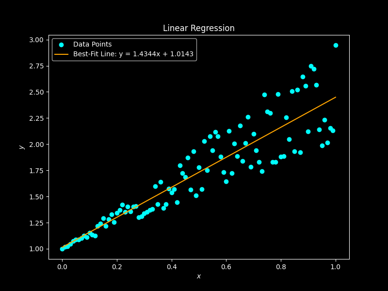

# Linear Regression using the Method of Least Squares

## Description

Linear regression is a fundamental statistical method used to model the relationship between a dependent variable ($y$) and one or more independent variables ($x$). The goal is to find the best-fit line, often expressed as a linear equation, that minimizes the sum of the squared differences between the observed data points and the corresponding points on the line.

The Method of Least Squares is a common approach to perform linear regression. It aims to find the coefficients (slope and y-intercept) that minimize the sum of the squared residuals. The residuals are the differences between the observed $y$ values and the $y$ values predicted by the linear equation. The linear equation for the best-fit line is usually represented as:
$$y = mx + c$$

where $y$ is the dependent variable (the variable to be predicted), $x$ is the independent variable (the variable used for prediction), $m$ is the slope of the line, and $c$ is the y-intercept (the value of $y$ when $x=0$).

This program calculates the slope and y-intercept of the best-fit line based on the provided data using the method of least squares


## How it Works

- The `main()` function initiates the linear regression process. This function allows you to provide the example data points for 'x' and 'y' and displays the equation of the best-fit line, including the slope and y-intercept.

- The `line_fit(x, y)` function is responsible for performing linear regression. It takes two arrays, 'x' and 'y', which represent the independent and dependent variables, respectively.
    - The program first calculates the mean of the 'x' values and stores it as `x_average`.
    - It checks if the denominator in the formula for the slope is zero. If it's zero, it means the data points are collinear, and a unique line of best fit cannot be determined. In such cases, the function returns 'None' for both the slope and y-intercept.
    - If the denominator is not zero, the function calculates the slope and y-intercept using the method of least squares.
    - Finally, the calculated slope and y-intercept are returned as a tuple.

- The `plot_results(x, y, slope, y_intercept)` function visualizes the data points and the best-fit line.

## Program Input & Output

As an example, I fit the points `x = np.linspace(0, 1, 101)` and `y = 1 + x + x * np.random.random(len(x))`. 

When you run the program, `line_fit.py`, the output will include a graphical representation of the data points and the best-fit line.

<p align="center">
  
</p>

```

Linear Regression using the method of Least Squares.

Best-Fit Line: y = 1.4344x + 1.0143
```