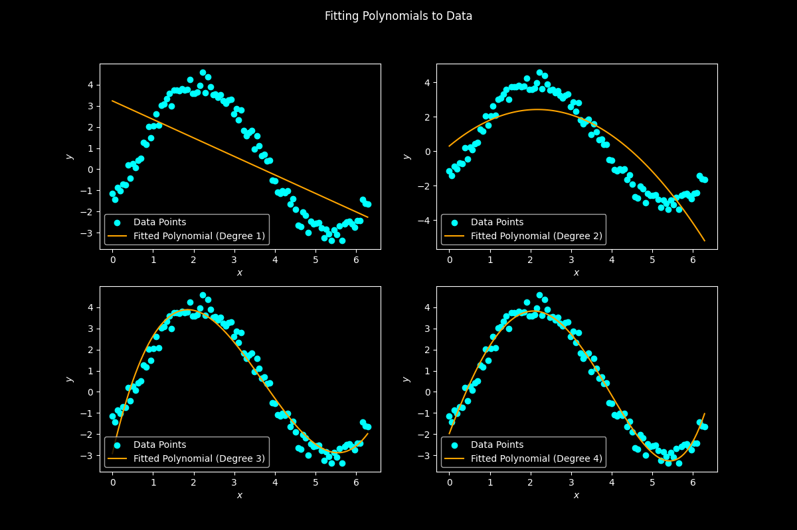

# Polynomial Fitting

## Description

Polynomial fitting is a mathematical technique used to approximate a relationship between variables using a polynomial function. The goal is to find a polynomial equation that best fits the given data points. This program demonstrates polynomial fitting to data and plots the results using different polynomial degrees.

## How it Works

This program uses `polyfit` function from NumPy to fit a polynomial to data. It finds the coefficients that minimize the squared error between the polynomial and the data points.

- The `main()` function demonstrates polynomial fitting to example data points.

- The `fit_polynomial(x, y, degree)` function fits a polynomial of the specified degree to the data using the `polyfit` function from NumPy and returns the coefficients.

- The `plot_results(ax, x, y, coefficients, degree)` function plots the data, the fitted polynomial, and displays the polynomial equation in the specified subplot.


## Program Input & Output

As an example, I fit the points `x = np.linspace(0, 2*np.pi, 100)` and `y = 3*np.sin(x) - 2*np.cos(x) + np.random.random(len(x))`. These data points represent a curve affected by noise.

When you run the program, `polynomial_fit.py`, the output will look like this;

<p align="center">
  
</p>


```

Fitting Polynomials to Data

Coefficients (degree: 1): [-0.88692124  3.27183724]
Coefficients (degree: 2): [-0.44372178  1.90106491  0.3817556 ]
Coefficients (degree: 3): [ 0.27406994 -3.02677008  8.36040675 -2.91508866]
Coefficients (degree: 4): [ 0.05405451 -0.40519911 -0.29215548  4.58655    -1.78316573]
```